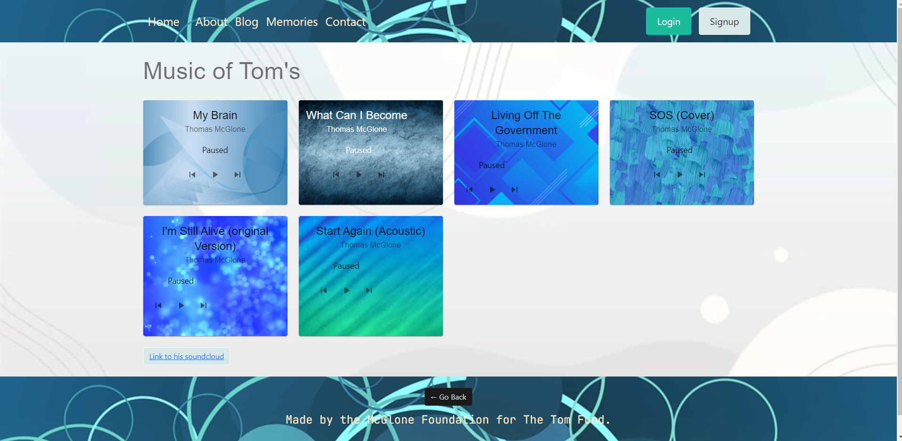

# tommysFund 

  ## Description

  * A non-profit organization needed a website
  * Include a blog for everyone to share ideas
  * Include the story of origin
  * As a User
    * When I open the homepage I am presented with info about the site
    * When I open the about page I am shown a story of the site
    * When I open the Blog page I can view/add posts and add comments
    * When I view the memories page I can play the music from the site

  
  
  ## Table of Contents
  * [Technologies](#technologies)
  * [Usage](#usage)
  * [Contributing](#contributing)
  * [License](#license)
  
  ## Technologies

  * Apollo
  * Bcrypt
  * Express
  * JsonWebToken
  * Mongoose
  * Graphql
  * React
  * Bootstrap
  * Material-ui
  * Javascript
  * HTML
  * CSS
  * Heroku for deployment

  ## Usage

  Navigate to the live webpage! https://powerful-crag-83957.herokuapp.com/

  This application is now live at http://thetomfund.com/ too!

  ## Home Page
  
  ## About Page
  
  ## Blog Page
  
  ## Profile Page
  
  ## Memories Page
  
  ## Contact Page
  

  ## Contributing

  For contributions please open an issue or new pull request

  ## Test

  n/a
  
  ## Questions

  I can answer questions via email or through github

  * Github Profile: [Alec74](https://github.com/Alec74)
  * alecmcglone@gmail.com
  * My [LinkedIn](https://www.linkedin.com/in/alec-mcglone-900904206/)
  
  ## License
  Notice: This application is licensed under MIT
  
  [License-Link](./LICENSE)